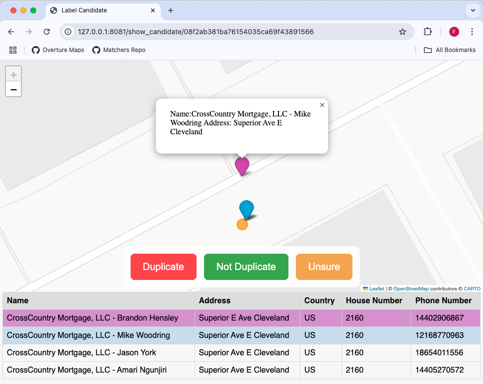

# Places Inspection & Labeling Tool

A web-based tool for inspecting places matches. Runs locally as a Flask app, displaying Folium-generated maps of potential duplicates.


## Install
Build from source using [poetry](https://python-poetry.org/):
```bash
poetry build
pip install dist/eubucco_conflator-*.whl
```

## Usage
Run the browser-based tool for a sample dataset via eubucco_conflation.run.py
```py
from eubucco_conflator import app
from eubucco_conflator.state import State

if  __name__  ==  '__main__':
	file_path  =  'data/sample_data.parquet'
	# Initialize the state with your custom input file
	State.init(file_path, logger=print)
	app.start()
```
