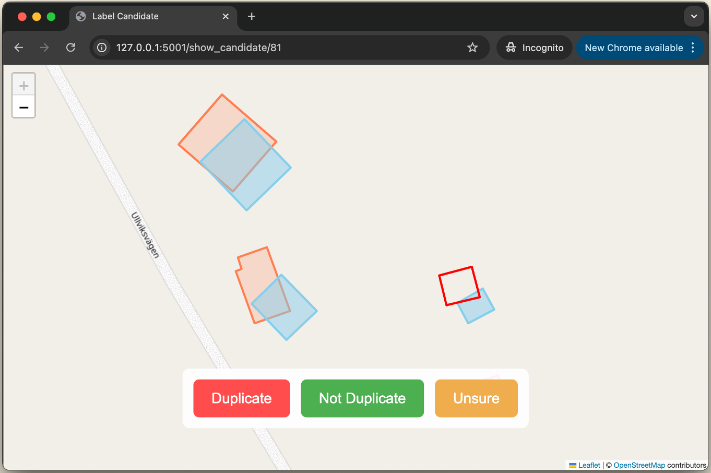

# Labeling Tool for Buildings and Places Matching

A web app for labeling matching building and place pairs from two datasets. Runs locally as a Flask app, displaying Folium-generated maps of potential matching pairs.

🔗 Live demo: [matching-demo.eubucco.com](https://matching-demo.eubucco.com)

📍 Supported feature types: Buildings & Places (POIs)

## Install
```bash
pip install git+https://github.com/ai4up/geo-matcher@main
```

## Usage
Step 1: Create a dataset of potential matching pairs from two datasets:
```bash
gmatch create-labeling-dataset dataset1.parquet dataset2.parquet
```

Step 2: Start browser-based labeling of pairs:
```bash
gmatch label
```

## Demo
Create a dataset of potential matches of [government buildings](https://eubucco.com/data/) and [Microsoft buildings](https://github.com/microsoft/GlobalMLBuildingFootprints) for a small region in France that require manual labeling  using the [demo data](data/) in the repository. Include only buildings which overlap slightly (0-10%).
```bash
gmatch create-labeling-dataset \
    --min-intersection=0.1 \ # Minimum relative overlap for new buildings to be included in labeling dataset [0,1)
    --max-intersection=0.2 \ # Maximum relative overlap for new buildings to be included in labeling dataset (0,1]
    data/demo-gov.parquet data/demo-microsoft.parquet
```
The resulting dataset is locally stored as `candidate-pairs.zip`. To initiate the browser-based labeling, run:
```bash
gmatch label
```



## Dockerized approach
> Prerequisites
> * Ensure a dataset of candidate pairs (`candidate-pairs.zip`) is present in the `data` directory.
> * For production deployment, set a [Flask session](https://flask.palletsprojects.com/en/stable/quickstart/#sessions) `SECRET_KEY` environment variable.

Serve the dockerized Flask app with an Nginx proxy at `http://localhost:80`:
```bash
docker-compose up
```

## Development

Install dev dependencies using [poetry](https://python-poetry.org/):
```bash
poetry install --only dev
```

Install git pre-commit hooks:
```bash
pre-commit install
```

Build from source:
```bash
poetry build
pip install dist/geo_matcher-*.whl
```
