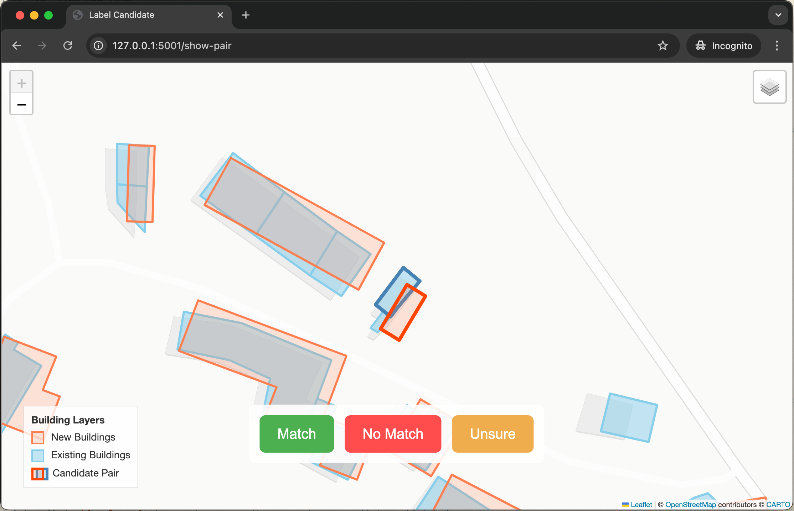

# Building Footprint Conflation Tool

A web-based tool for conflating building footprint datasets, visually identifying duplicates, and labeling them. Runs locally as a Flask app, displaying Folium-generated maps of potential duplicates.


## Install
Build from source using [poetry](https://python-poetry.org/):
```bash
poetry build
pip install dist/eubucco_conflator-*.whl
```

## Usage
Create a dataset of potential duplicate buildings for manual inspection and labeling from two footprint datasets:
```bash
conflator create-labeling-dataset dataset1.parquet dataset2.parquet
```
Optionally, specific thresholds for which buildings to include:
```bash
conflator create-labeling-dataset \
    --min-intersection=0.0 \ # Minimum relative overlap for new buildings to be considered for duplicate labeling [0,1)
    --max-intersection=0.2 \ # Maximum relative overlap for new buildings to be considered for duplicate labeling (0,1]
    --distance=100 \ # Distance threshold for displaying neighboring buildings [meters]
    dataset1.parquet dataset2.parquet
```

Initiate browser-based labeling:
```bash
conflator label
```


